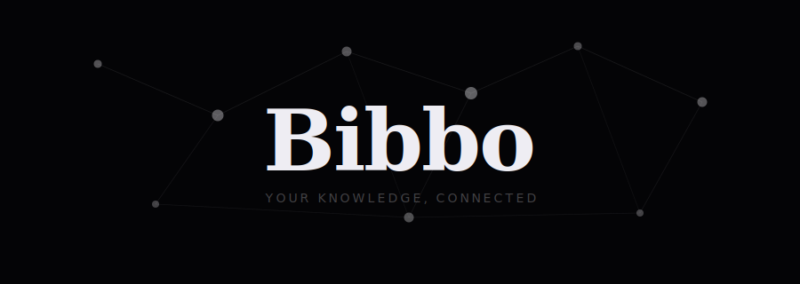

  

 

A native desktop knowledge graph. Write nodes. Connections emerge.

> **Private beta.** Not publicly available yet.

---

## Why this works

Your brain doesn't store knowledge in lists — it stores it in **connections**. When you link two ideas together you're not just filing them away, you're making a claim about *why* they relate. The more paths that lead to a concept, the deeper your understanding of it becomes.

Most note-taking tools fight this. Folders create silos. Lists hide relationships. Bullet points flatten what is inherently dimensional.

Bibbo is built around the structure of thought itself. Every `[[link]]` you write forces you to ask: *how does this connect to what I already know?* Over time your graph becomes a map of your understanding — and the gaps in it show you exactly where to go next.

---

## The science

Human memory is **associative, not hierarchical**. Collins & Loftus (1975) showed that recall works through *spreading activation* — you access a memory by traversing related concepts, not by navigating folders. When you think "Einstein," you don't open a mental drawer labeled "Physics > 20th Century." You move through a web of associations.

Folders fight this. A graph mirrors it.

Three things Bibbo does that matter scientifically:

**Living Connections — relationship epistemology.**
Obsidian links are boolean: connected or not. Bibbo's Living Connections expose *why* two nodes are connected — which documents reference them together, how recently, how strongly. That contextual metadata is epistemically meaningful.

**Temporal decay and salience.**
Old nodes fade, recently edited nodes glow. This mirrors the brain's recency and frequency biases and makes the graph a living picture of your current thinking rather than a static archive.

**Weight from incoming references.**
Node size grows with references. This is a PageRank-style importance signal derived from your own knowledge. The nodes that matter to your thinking become visually prominent automatically.

---

## Why Bibbo over Obsidian?

**Obsidian is a platform. Bibbo is a single focused experience.**
No configuration. No plugins. No folder decisions. You open it and think.

**In Obsidian, the graph is a feature. In Bibbo, the graph is the app.**
Obsidian's graph view is something you occasionally open to admire. In Bibbo, you write *into* the graph.

**Bibbo's graph is alive.**
Physics-based simulation: nodes repel, spring toward their connections, and settle into organic arrangements. It feels like a brain, not a diagram.

**No folders. No hierarchy. No decisions.**
There is one graph. Everything lives in it. The only structure is the one that emerges from your thinking.

---

## Keybinds

**Writing**

| Key | Action |
|---|---|
| `Ctrl + N` | New node |
| `[[Title]]` | Link to a node |
| `Esc` | Save & return |

**Graph**

| Key | Action |
|---|---|
| Click node | Enter local view |
| Click again | Open writing mode |
| Click neighbor | Expand web |
| Click edge | See why connected (Living Connections) |

**Navigate**

| Key | Action |
|---|---|
| `Ctrl + K` | Search |
| Scroll | Zoom |
| Drag | Pan canvas |
| `Esc` | Back / close |

**Data**

| Key | Action |
|---|---|
| `Ctrl + E` | Export to .md files |
| `Ctrl + I` | Import .md folder |
| `Ctrl + H` | Help & keybinds |

---

## Data storage

Your data is local. Always.

- Windows: `%APPDATA%\Bibbo\bibbo.db`
- macOS: `~/Library/Application Support/Bibbo/bibbo.db`
- Linux: `~/.local/share/Bibbo/bibbo.db`

---

## Stack

Java 21 · JavaFX · SQLite — native installer per platform, JVM bundled, no install required for end users.

---

## License

Source code is proprietary. All rights reserved.
