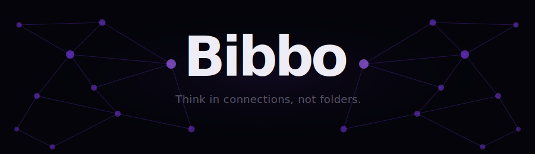

  

   

  
  
  

---

**Bibbo is a native desktop knowledge graph.** Not a notes app. Not a file manager. A tool for people who think in systems — where what you know matters less than how it connects.

You write nodes. You reference them with `[[Title]]`. Bibbo resolves the links, runs the physics, and builds the graph automatically. You don't organize your knowledge — you express it, and Bibbo makes the structure visible.

The graph is not a sidebar. It *is* the app.

---

## Why it works

The way most software forces you to store knowledge — folders, tags, hierarchies — is the opposite of how your brain retrieves it. Memory doesn't work by location. It works by association.

**Spreading activation** (Collins & Loftus, 1975) — you recall ideas by traversing related concepts. Filing a note under `/Projects/Q3/Research/Topic` doesn't mirror that. Linking `[[Topic]]` inside a related node does.

**Elaborative interrogation** — the cognitive act of asking *why* two ideas are related is the learning act itself. Every link you draw in Bibbo is a moment of understanding made explicit. This is why Bibbo shows you *why* two nodes are connected, not just that they are.

**Recency and frequency bias** — the brain naturally weights recent and frequently-accessed memories as more salient. Bibbo's visual decay (nodes fade with age) and weight system (size grows with references) mirror these biases so your graph reflects your active thinking, not an equal-weight archive.

---

## What makes it different

**Living Connections** — click any edge and see exactly why two nodes are related: which ideas reference them together, what the shared context is. This is Bibbo's signature feature.

**One global graph** — no folders, no vaults, no hierarchy. One graph. Structure emerges from your connections, not from where you decided to file something.

**Physics layout** — nodes repel, springs pull connected nodes closer, the graph settles into organic clusters. Drag a node and the network responds. It feels like thinking.

**Temporal salience** — recently written nodes glow. Old nodes fade. The graph is a live picture of what's active in your mind *right now*.

**Native, local, instant** — no Electron, no cloud, no account. A real native app that opens instantly. Your data is a single SQLite file on your machine.

---

## Built for

- Researchers mapping a literature space
- Writers building world or plot structure
- Engineers reasoning about a complex system
- Anyone whose thinking outgrows flat lists

---

## Get early access

Private beta is active. Installers exist for Windows, macOS (Apple Silicon + Intel), and Linux.

**[→ Request access at horadomu.github.io/BibboPage](https://horadomu.github.io/BibboPage)**

---

  © 2026 HoraDomu. All rights reserved. You may not copy, fork, or redistribute the source code.

